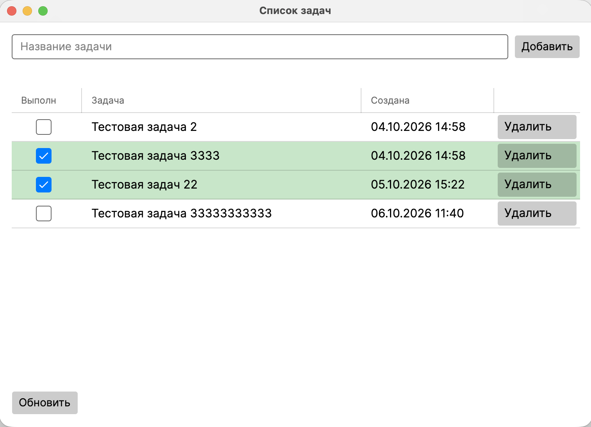

# TaskManager

Список задач на Avalonia UI и PostgreSQL (EF Core 8). Один проект UI `TaskManager.Desktop`, тесты в `TaskManagerTests`.



## Запуск

Нужны .NET SDK 8 и Docker.

```bash
docker compose up -d
dotnet run --project TaskManager.Desktop
```

Postgres: порт **5433**, база `tasks`, пользователь и пароль `taskmanager`. Миграция `InitialCreate` применяется при старте (`Database.Migrate()`). Если база недоступна, окно всё равно открывается.

## Архитектура

MVVM внутри одного десктопного проекта.

- **View** — `MainWindow.axaml`, привязки и команды, code-behind только инициализация и закрытие окна.
- **ViewModel** — `MainViewModel` (список, ввод, ошибки, команды), `TaskRowViewModel` (строка таблицы).
- **Сервис** — `TaskService`: валидация FluentValidation, AutoMapper, один вызов репозитория на операцию.
- **Репозиторий** — `TaskRepository` над `DbSet`, мягкое удаление, транзакция на чтение+запись.
- **Данные** — `TaskDbContext` (scoped), query filter `!IsDeleted`. `TaskDbContextFactory` только для `dotnet ef`.

Ошибки ловит `ExceptionHandlingMiddleware`, в окне показывается текст из `ErrorText`. `DbContext` живёт скоуп на операцию: ViewModel — синглтон и не держит сервис в поле.

## Порядок запуска приложения

1. `Program.Main` собирает DI (`AppServices.Build`).
2. Подписка на необработанные исключения.
3. `ApplyMigrations` — scoped-контекст, `Migrate()`.
4. Avalonia: `StartWithClassicDesktopLifetime`.
5. `App` создаёт `MainWindow`, кладёт `MainViewModel` в `DataContext`, вызывает `ReloadCommand`.
6. Закрытие окна: `Dispose` у ViewModel (отмена токена); после выхода из цикла сообщений уничтожается контейнер.

## Тесты

```bash
dotnet test --project TaskManagerTests
```

Нужен запущенный Docker: репозиторий гоняется на эфемерном Postgres (Testcontainers).

Порядок прогона класса репозитория:

1. xUnit создаёт `PostgresFixture`.
2. `InitializeAsync` — `Container.StartAsync()`.
3. Конструктор `TaskRepositoryTests`, факты (`AddAsync` / чтение).
4. `DisposeAsync` — контейнер гасится.

Валидатор (`TaskModelValidatorTests`) Docker не использует: контейнер Autofac, `TestValidate` пустого и слишком длинного `Title`.
